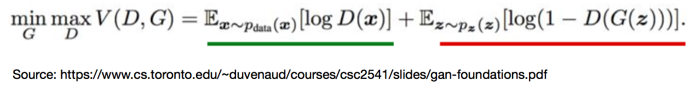
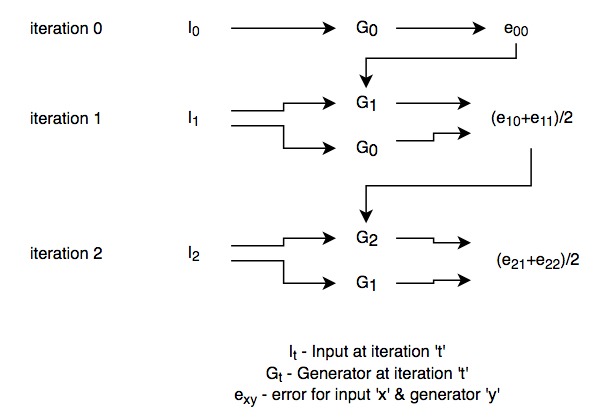
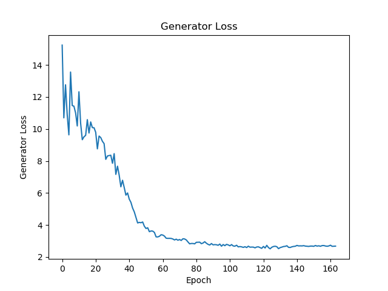
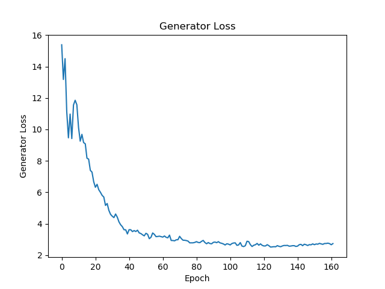
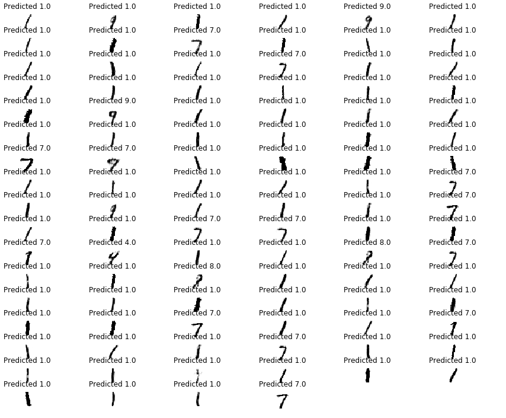
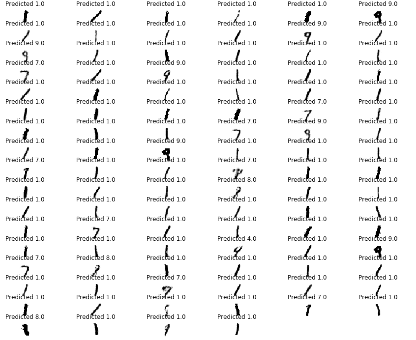

# GAN-Regret-Minimization
A regret minimization approach to training Generative Adversarial Networks (GANs). This was my project in the "Algorithms and Optimization for Big Data" course.

Training Generative Adversarial Networks (GANs) has been a major research problem ever since its inception. The motivation for this project was to devise a method which can accelerate the convergence rate of GANs. The general human approach is to minimize the regret in life by learning from the past. This regret minimization approach, has been well established in the domain of game theory. We know that in GANs, the generator and discriminator are involved in a minimax game. So, it seemed natural to try this approach in the training of GANs.

The regret minimization approach splits into 2 implementations: global regret and local regret. Since, global regret is computationally intractable, so the local regret approach was pursued. The general setting for a game is described as follows: At iteration 't', Learner chooses some action xt, adversary provides a loss function f(xt) which indicates the loss suffered by the learner.

In GANs, the loss function is defined by:

At every iteration, we are presented with a new loss function which is included in the overall regret function to be minimized. What we mean by different loss functions at each iteration is that, since generator and discriminator are neural networks, when the weights in these networks changes, the loss function changes.

We define the architecture for this regret approach as:  

We applied the notion of local regret to the generator. Basically, the generator generates images, discriminator distinguishes them as real or fake. Backpropagation is applied on the regret loss function through mini-batch gradient descent. This approach was applied to models without regret (w=1) and with regret (w=2).    

&nbsp;&nbsp;&nbsp;&nbsp;&nbsp;&nbsp;&nbsp;&nbsp;&nbsp;&nbsp;&nbsp;&nbsp;&nbsp;&nbsp;&nbsp;&nbsp;&nbsp;&nbsp;&nbsp;&nbsp;&nbsp;&nbsp;&nbsp;&nbsp;&nbsp;&nbsp;&nbsp;&nbsp;&nbsp;&nbsp;&nbsp;&nbsp;Generator loss: w=1&nbsp;&nbsp;&nbsp;&nbsp;&nbsp;&nbsp;&nbsp;&nbsp;&nbsp;&nbsp;&nbsp;&nbsp;&nbsp;&nbsp;&nbsp;&nbsp;&nbsp;&nbsp;&nbsp;&nbsp;&nbsp;&nbsp;&nbsp;&nbsp;&nbsp;&nbsp;&nbsp;&nbsp;&nbsp;&nbsp;&nbsp;&nbsp;&nbsp;&nbsp;&nbsp;&nbsp;&nbsp;&nbsp;&nbsp;&nbsp;&nbsp;&nbsp;&nbsp;&nbsp;&nbsp;&nbsp;&nbsp;&nbsp;&nbsp;&nbsp;&nbsp;&nbsp;&nbsp;&nbsp;&nbsp;&nbsp;&nbsp;&nbsp;Generator loss: w=2

As can be seen from the images, the generator loss for w=2 converges faster than that for w=1. 

A pre-trained SVM model was used to measure the accuracy of the generator by evaluating the prediction for input generated images in SVM. The results of the SVM model for cases without regret (w=1) and with regret (w=2).    
&nbsp;&nbsp;&nbsp;&nbsp;&nbsp;&nbsp;&nbsp;&nbsp;&nbsp;
&nbsp;&nbsp;&nbsp;&nbsp;&nbsp;&nbsp;&nbsp;&nbsp;&nbsp;&nbsp;&nbsp;&nbsp;&nbsp;&nbsp;&nbsp;&nbsp;&nbsp;&nbsp;&nbsp;&nbsp;&nbsp;&nbsp;&nbsp;&nbsp;&nbsp;&nbsp;&nbsp;&nbsp;&nbsp;&nbsp;&nbsp;&nbsp;SVM prediction: w=1&nbsp;&nbsp;&nbsp;&nbsp;&nbsp;&nbsp;&nbsp;&nbsp;&nbsp;&nbsp;&nbsp;&nbsp;&nbsp;&nbsp;&nbsp;&nbsp;&nbsp;&nbsp;&nbsp;&nbsp;&nbsp;&nbsp;&nbsp;&nbsp;&nbsp;&nbsp;&nbsp;&nbsp;&nbsp;&nbsp;&nbsp;&nbsp;&nbsp;&nbsp;&nbsp;&nbsp;&nbsp;&nbsp;&nbsp;&nbsp;&nbsp;&nbsp;&nbsp;&nbsp;&nbsp;&nbsp;&nbsp;&nbsp;&nbsp;&nbsp;&nbsp;&nbsp;&nbsp;&nbsp;&nbsp;&nbsp;&nbsp;&nbsp;&nbsp;&nbsp;&nbsp;&nbsp;&nbsp;&nbsp;&nbsp;&nbsp;&nbsp;SVM prediction: w=2

The results demonstrate the efficacy of the aforementioned approach. This approach leads to faster convergence rate in training of GANs while maintaining approximately same accuracy level.
